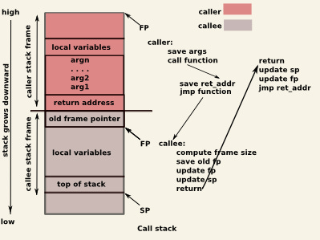

# Memory Model

### Memory Layout

Variables can either be _created_ or _destroyed._ They can also exists on different locations (i.e the **stack**, **heap** or **static storage)**&#x20;

<figure><figcaption></figcaption></figure>

### Stack vs Heap

#### Stack

Variables created (i.e allocated) on the stack possess automatic storage duration. This means they are:

* allocated when execution enters their scope
* deallocated when out of scope

<details>

<summary>Why is stack allocation fast?</summary>

<figure><figcaption><p>src: <a href="https://chessman7.substack.com/p/how-your-code-executes-a-guide-to">https://chessman7.substack.com/p/how-your-code-executes-a-guide-to</a> </p></figcaption></figure>

Allocating (and deallocating) variables on the stack is fast as it mainly involves incrementing (and decrementing) the stack pointer.

This is also the reason why uninitialized variables on the stack possess garbage values because the memory they occupy is not automatically zeroed.

</details>

To jog your memory, all the previous variable declarations in  [variables.md](../cpp-fundamentals/variables.md "mention") and  [pointers.md](pointers.md "mention") were all allocated on the stack.


```cpp
int x = 5;
int arr[3] = {10, 20, 30}; 

int x = 10;
int* p = &x;

// this copies the string literal onto the array on the stack
char str[] = "hello";
```


Consider the following example (please ignore the implementation details of `Person`  class for now)


```cpp
#include <iostream>

class Person
{
private:
    int age_;

public:
    Person(int age) : age_(age)
    {
        std::cout << "creating a person with " << this->age_ << std::endl;
    }
    int get_age()
    {
        return this->age_;
    }
    ~Person()
    {
        std::cout << "destroying a person with " << this->age_ << std::endl;
    }
};

int main()
{
    Person p1(10);
    Person p2(15);
    Person p3(20);
}
```


The following output is as shown:

<figure><figcaption></figcaption></figure>

Observe that similar to the Last-In-First-Out (LIFO) behaviour of literal stack data structure, objects are constructed in order of declaration. They are also destroyed in order of reverse order.

<figure><figcaption></figcaption></figure>

Note that the behaviour is tied to scope, objects are destroyed as soon as it exits the scope.

<table><thead><tr><th>Code</th><th>Output</th></tr></thead><tbody><tr><td><p></p><pre class="language-cpp" data-title="main.cpp"><code class="lang-cpp">int main()
{
    Person p1(10);
    {
        Person p2(15);
    }
    Person p3(20);
}
</code></pre></td><td></td></tr></tbody></table>

### Heap

While the stack is fast, it does suffer from a few limitations:

* Size of the objects must be known / determinable at compile time
* The lifetime of objects is tied to scope

<details>

<summary>⚠️ More about the limitation</summary>

Consider the following code snippet:

```cpp
int main()
{
    int n;
    std::cin >> n;
    int arr[n];
}
```

It _appears_ to work when we try running with `clang++ main.cpp -o hello-world`&#x20;

But look what happens when I try to run with stricter flags:   `clang++ -std=c++17 -Wall -Wextra -pedantic-errors main.cpp`


This is because VLA (Variable-Length Arrays) are actually not part of standard C++. Indeed, the size of arrays **must** be known at compile-time.&#x20;

Following the above school of thought, why does the below code still not work? 🤔

```cpp
int main()
{
    int n = 5;
    int arr[n];
}
```

<figure><figcaption></figcaption></figure>

</details>

You can use a `new` keyword to allocate memory. Unlike the stack, the heap memory is not tied to scope. It persists until it is explictly deallocated with `delete.`

Let's take a look at how heap tackles these limitations:


```cpp
#include <iostream>

int main()
{
    int n;
    std::cin >> n;
    int* arr = new int[n];
    for (int i = 0; i < n; i++) 
        arr[i] = i;
    for (int i = 0; i < n; ++i)
        std::cout << arr[i] << " ";
}
```


<figure><figcaption></figcaption></figure>

<details>

<summary>⚠️  <strong>Spot</strong> the error in the above code snippet</summary>

We've just encountered a common pitfall of allocating variables on the heap. The above code snippet is plagued by a **memory leak.**&#x20;

The memory allocated using `new` is never `deallocated` using `delete` .  This means the allocated memory remains reserved after after it's no longer needed.

We can fix the code by appending `delete[] arr;` to the back of the program like so:


```cpp
#include <iostream>

int main()
{
    int n;
    std::cin >> n;
    int* arr = new int[n];
    for (int i = 0; i < n; i++) 
        arr[i] = i;
    for (int i = 0; i < n; ++i)
        std::cout << arr[i] << " ";
    delete[] arr;
}
```


</details>

#### Dangling Pointers

Another common pitfall that programmers often stumble upon is the issue of dangling pointers. This refers to the situation when we try to access memory that already has been deallocated.


```cpp
#include <iostream>
int main() {
    int *p = new int(5);
    std::cout << *p << std::endl;
    delete p;
    std::cout << *p << std::endl; 
}
```


The above is an example of [**undefined behavior**](https://stackoverflow.com/questions/28727439/is-it-undefined-behavior-to-dereference-a-dangling-pointer)**.** For me, it prints 0 but the C++ standard makes no guarantees what about what happens.&#x20;

<figure><figcaption></figcaption></figure>

It could also potentially print 5, print garbage values or crash through a segmentation fault.
